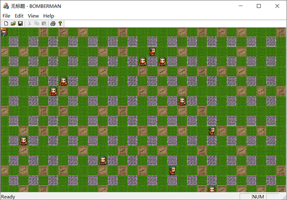

# 炸弹超人游戏

## 游戏介绍
- 该项目为炸弹人游戏，可以实现对玩家的移动控制和投放炸弹炸宝箱或者敌人，炸宝箱可以有几率获得道具使玩家的炸弹进行升级。游戏中会随机实例化敌人出生的位置，并且敌人会随机移动，如果被敌人抓到或者被自己的炸弹炸死则游戏结束。
- 游戏的输入控制：上下左右分别控制玩家向四个方向移动，按空格键则可以释放炸弹。
- 开发环境：**``vs2017、OpenGL、MFC``**

## 游戏效果

 1. 游戏开始，玩家会出现在屏幕的左上方，敌人也会随机生成，并且按照随机方向移动。

    

 2. 通过上下左右控制玩家移动，按下空格则会释放炸弹，炸弹在规定时间过后会产生爆炸效果（这里规定时间我们设置的是3秒）。

    

 3. 可以通过释放炸弹炸宝箱来有几率的获得道具（下图中红色火焰即为道具 我们可以走过去拾取道具来使我们的爆炸范围变大）

    

 4. 当玩家被炸弹炸到或者被敌人碰到时，游戏随即结束。

    

## 游戏实现
1. **主要框架**

   **``下图为游戏的几个主要的类，另外还有两个枚举第一个为游戏地图方格的枚举（CellType），第二个为玩家或敌人移动方向的枚举（Forward）。``**

   

2. **View类**

   **``这个类主要实现对纹理的装载、图形的绘制、显示窗口的调整、键盘消息的响应、以及给定游戏全局时间。``**

   **主要代码**：

   ```c++
   void CBOMBERMANView::Init(void)
   {
   	HGLRC hrc;
   	m_pDC = new CClientDC(this);
   	if (!bSetupPixelFormat())
   		return;
   
   	hrc = wglCreateContext(m_pDC->GetSafeHdc());
   	wglMakeCurrent(m_pDC->GetSafeHdc(), hrc);
   
   	glEnable(GL_TEXTURE_2D);
   
   	loadTexture();
   
   	MyGame._time = 0;
   
   	MyGame.maze.Texture = Texture;
   	SetTimer(1, 100, NULL);
   }
   void CBOMBERMANView::OnDraw(CDC* /*pDC*/)
   {
   	CBOMBERMANDoc* pDoc = GetDocument();
   	ASSERT_VALID(pDoc);
   	if (!pDoc)
   		return;
   
   	// TODO: add draw code for native data here
   	MyGame.draw();
   }
   void CBOMBERMANView::OnKeyDown(UINT nChar, UINT nRepCnt, UINT nFlags)
   {
   	// TODO: 在此添加消息处理程序代码和/或调用默认值
   	MyGame.player.move(nChar, MyGame._time);
   	CView::OnKeyDown(nChar, nRepCnt, nFlags);
   }
   void CBOMBERMANView::OnTimer(UINT_PTR nIDEvent)
   {
   	// TODO: 在此添加消息处理程序代码和/或调用默认值
   	MyGame._time++;		//计时开始
   
   	MyGame.manageBomb();
   	
   	Invalidate();
   	CView::OnTimer(nIDEvent);
   }
   ```
   
3. **player类**

   **``这个类主要实现对游戏玩家的控制，通过键盘消息来实现对玩家移动的控制、炸弹的释放，道具的管理。``**

   **主要代码：**

   ```c++
   //玩家移动
   void Player::move(int key,double time) {
   	int n_x = p_x, n_y = p_y;
   	
   	switch (key)
   	{
   	case VK_SPACE:
   		if (maze->getCellVal(p_x, p_y) != boom) {
   			maze->setCellVal(p_x, p_y, 94 + p_forWard);
   			bullet = new Boom(p_x, p_y, boomid++, range, time);		//制造炸弹
   			boomlist->push_back(bullet);							//放入链表
   			point[n++].x = p_x;
   			point[n++].y = p_y;
   		}
   		return;
   		break;
   	case VK_UP:
   		p_forWard = top;
   		maze->play_forward = playerUp1;
   		n_x--;
   		maze->play_x = 0;
   		maze->play_y = -0.25;
   		break;
   	case VK_RIGHT:
   		p_forWard = right;
   		n_y++;
   		maze->play_x = 0.25;
   		maze->play_y = 0;
   		maze->play_forward = playerRight1;
   		break;
   	case VK_DOWN:
   		p_forWard = bottom;
   		n_x++;
   		maze->play_x = 0;
   		maze->play_y = 0.25;
   		maze->play_forward = playerDown1;
   		break;
   	case VK_LEFT:
   		p_forWard = left;
   		n_y--;
   		maze->play_x = -0.25;
   		maze->play_y = 0;
   		maze->play_forward = playerLeft1;
   		break;
   	default:
   		break;
   	}
   
   	int tvalue = maze->getCellVal(n_x, n_y);
   	if (!borderCheck(n_x, n_y) || !collisonCheck(tvalue))
   		return;
   
   	if (maze->getCellVal(n_x, n_y) == reward)
   		range++;
   	
   
   	maze->isStop = false;
   	maze->count = 0;
   
   	if (maze->getCellVal(p_x, p_y) >= playerWboomUp
   		&& maze->getCellVal(p_x, p_y) <= playerWboomLeft)
   	{
   		maze->setCellVal(p_x, p_y, boom);
   	}
   	else
   	{
   		maze->setCellVal(p_x, p_y, normal);
   	}
   	 p_x= n_x ,  p_y= n_y ;
   	 maze->setCellVal(p_x, p_y, 90 + p_forWard);
   
   
   	 if (tvalue >= monsterUp && tvalue <= monsterLeft)
   	 {
   		 maze->gameOver = true;
   	 }
   }
   ```

4. **Boom类**

   **``这个类主要实现对炸弹数据的初始化、爆炸时间的控制以及爆炸范围的控制。``**

   **主要代码：**
   
   ```c++
   int x, y, startTime, rang, boomTime, boomId;//坐标 开始时间 爆炸范围 爆炸时间 id
   void explose(Maze* maze);//爆炸
   bool Boom::eachCase(int x, int y, Maze* maze);//遍历四周是空地还是道具
   bool timeOver(double time);//判断是否到达爆炸时间

5. **Game类**
	**``这个类主要实现对游戏的管理，给定游戏全局时间，管理炸弹管理敌人和游戏结束界面的管理``**
	
	**主要代码：**
	
	```c++
	void manageBomb();//管理炸弹
	void Game::draw()//绘制场景
	void Game::createMonster()
	```

6. **Monster类**

   **``这个类主要实现对敌人的管理，随机一个位置出现敌人，当敌人碰到墙壁时随机一个方向使其不停地在地图中游走。``**

   主要代码：

   ```c++
   Monster(int x, int y, Maze* mazes);//随机一个敌人的产生位置
   void Move();//敌人移动
   bool collisonCheck(int);
   bool borderCheck(int x, int y);
   int m_x, m_y, m_forWard;//敌人出现的位置
   bool alive;//判断是否存活
   ```

   

   

